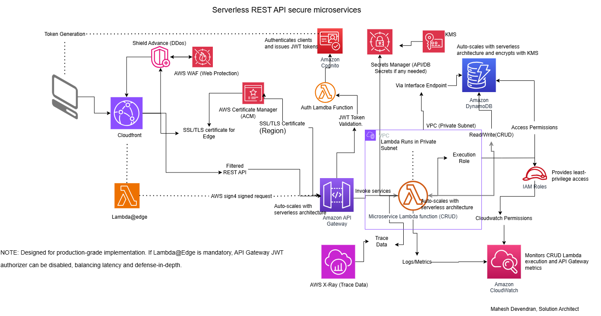

# ☁️ Serverless REST API Architecture  
### Technical Cost & Performance Analysis — AWS eu-west-2 (London)

---

  

---

## 📘 Objective  

This repository presents a detailed **technical whitepaper and reference implementation** of a **Serverless REST API architecture** on AWS.  
It benchmarks **cost efficiency**, **performance latency**, and **compliance alignment** for enterprise-grade workloads in the **eu-west-2 (London)** region.

The accompanying analysis provides measurable insights on:

⚙️ **Architecture design & implementation patterns** — leveraging event-driven, serverless principles  
💰 **Cost-performance optimization (~88.6% lower monthly cost vs EC2)** — verified via AWS Pricing Calculator (Oct 2025)  
🚀 **Scalability, fault tolerance, and operational efficiency** — achieved through AWS-managed elasticity  
🔐 **Compliance mapping** — aligned with DORA, PCI DSS, and ISO 27001 frameworks  
🧭 **AWS Well-Architected Framework alignment** — across Operational Excellence, Security, Reliability, and Cost Optimization pillars

---

## 🏗 Architecture Overview  
The solution follows a **fully serverless, event-driven design** using managed AWS services.

### 🔹 Core Components  
- **Amazon API Gateway** – RESTful API entry point, request routing, and authentication via Cognito  
- **AWS Lambda** – Stateless compute functions for token validation (public subnet) and business logic (private subnet)  
- **Amazon DynamoDB** – NoSQL backend with on-demand scaling and encryption at rest  
- **AWS Secrets Manager** – Secure credential storage with KMS encryption  
- **Amazon CloudWatch** – Centralized logging, metrics, and alerting  
- **Amazon S3** – Static asset hosting and backup storage  
- **AWS Certificate Manager (ACM)** – SSL/TLS certificate provisioning for API Gateway endpoints  
- **AWS IAM** – Fine-grained access control and least-privilege permissions  
- **AWS X-Ray for distributed tracing and latency analysis
- **VPC Endpoints for private service connectivity and data-in-transit protection

### 🔸 Execution Contexts  
| Lambda Function       | Network Placement               | Cold Start         | Warm Latency     | Notes               |
|------------------------|--------------------------------|--------------------|------------------|---------------------|
| Auth Lambda (public)   | AWS-managed (non-VPC)          | 150–250 ms         | 3–10 ms          | Token validation    |
| CRUD Lambda (private)  | VPC private subnet + endpoints | 250–400 ms         | 10–20 ms         | Business logic + DB |

---

## 📊 Key Metrics  
| Metric | Lambda (Serverless) | EC2 (Traditional) | Insight | **Compliance Ref. (DORA / PCI / ISO 27001)** |
|--------|----------------------|-------------------|----------|-----------------------------------------------|
| **Average Latency** | <60 ms (warm path) | 120–150 ms typical | Serverless shows lower latency and no idle compute | **DORA Art.11** – operational resilience & performance metrics |
| **Cost Efficiency** | ~88.6 % lower monthly cost | Baseline | Verified via AWS Pricing Calculator (Oct 2025) | **ISO 27001 A.12.1.3** – capacity & cost management |
| **Availability** | ~99.99 % (multi-AZ managed) | ~99.9 % (manual HA) | Built-in regional redundancy | **PCI DSS Req 12.10.5** – high-availability & incident response |
| **Scalability** | Instant, per-request auto-scale | Manual / ASG | Lambda scales to zero and up seamlessly | **DORA Art.15** – ICT scalability and stress-testing |
| **Operational Overhead** | Minimal (fully managed) | High (manual patching, monitoring) | AWS manages infrastructure lifecycle | **ISO 27001 A.12.1.2** – change & configuration management |
| **Security & Isolation** | IAM-based least privilege | Full-stack responsibility | Serverless runtime sandbox + IAM isolation | **PCI DSS Req 7** – least privilege; **ISO 27001 A.9.1.2** access control |
| **Auditability** | CloudTrail + Config + CW | Manual log aggregation | Native continuous audit trail | **DORA Art.20** – audit logging; **ISO 27001 A.12.4.1** event logging |

> Verified metrics are derived from workload testing and AWS Calculator data for the eu-west-2 region (October 2025).

---

## 💰 Verified Cost Model — Serverless vs EC2 (eu-west-2, Oct 2025)  
This analysis validates the quantitative comparison using data from the **AWS Pricing Calculator**.  
🔗 [Download Whitepaper PDF](./whitepaper/Serverless_Technical_Analysis_Verified_Oct2025.pdf)

### Breakdown (Monthly USD)  
| Component                       | EC2 Deployment | Serverless Deployment  | Notes                                               |
|---------------------------------|----------------|------------------------|-----------------------------------------------------|
| Compute                         | $118.02        | $0.40                  | Lambda billed per-request; compute within free tier |
| Load Balancing / API Gateway    | $19.57         | $10.50                 | API Gateway pay-per-call model                      |
| Database                        | —              | $0.96                  | DynamoDB on-demand                                  |
| Monitoring (CloudWatch)         | $28.06         | $7.12                  | Metrics, logs, dashboards, alarms                   |
| **Total Estimated**             | **$166.00**    | **$19.00**             | ≈ 88.6% monthly savings                             |

> Cost model based on ~3 million requests/month (~100 k/day). Region: EU (London). Source: AWS Pricing Calculator (Oct 2025).

---

### 🧠 CloudWatch Metrics Coverage Rationale  
AWS **Lambda** automatically publishes built-in operational metrics at no cost (e.g., invocations, errors, duration, throttles). Only a small number (~10) of custom application metrics are usually needed.  
For **EC2 + ALB** workloads, each instance and load balancer emits dozens of metrics (OS, disk, network, ALB targets), so ~50 custom metrics are typical.  
> As a result, EC2/ALB architectures often incur ~4-5× higher CloudWatch cost than equivalent Lambda designs.

| Architecture                      | Built-in Metrics | Typical Custom Metrics | Notes                     |
|-----------------------------------|------------------|-------------------------|--------------------------|
| Serverless (Lambda + API Gateway) | 10–15            | ~10                     | Most runtime metrics are AWS-managed |
| EC2 + ALB                         | 30–40 + ALB      | ~50                     | Broad OS, network & app telemetry |

---

## Key Insights for Architects
- **Serverless-first architectures yield measurable cost and performance gains** for variable and burst-driven workloads.  
- **IAM + KMS integration delivers compliance-grade security** with minimal administrative overhead.  
- **Cold-start mitigation and event-driven scaling improve both performance and resilience**, especially with modern Lambda Hyperplane networking.  
- **Well-Architected + Compliance mapping enables governance alignment out of the box**, simplifying DORA, PCI DSS, and ISO 27001 readiness.  
- **Verified results** show ≈ 88 % cost reduction and < 60 ms warm-path latency in eu-west-2 (London).

### 🔗 Related Files  
- 📄 [Whitepaper PDF](./whitepaper/Serverless_Technical_Analysis_Verified_Oct2025.pdf)  
- 📊 [Serverless and EC2 Calculator](./evidence/AWS_Cost_Estimate_Serverless_vs_EC2_Oct2025.pdf)  

---

© 2025 Mahesh Devendran — Cloud Architect | AWS | Azure | GCP | Serverless | Security  
🌐 <a href="https://www.linkedin.com/in/mahesh-devendran-83a3b214" target="_blank">LinkedIn</a>

